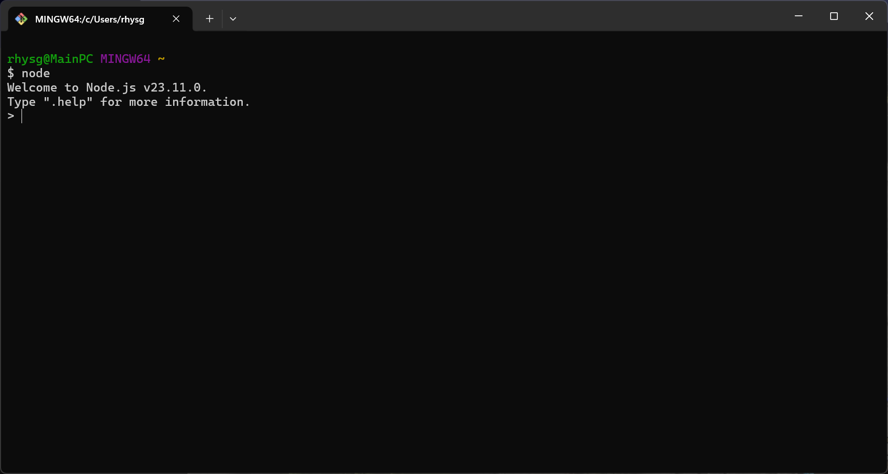

# Full Stack JavaScript Application

## Introduction

Applications exist in multiple locations to accomplish different needs, traditionally HTML, CSS, and JavaScript is rendered and delivered to a user. This is called the frontend as it is the segment of the application that a user directly sees and interacts with. 

A user can make requests (such as navigating to a different webpage) and the server responds with data that can be a webpage or data that is stored within a database. The server that responds is traditionally the start of the backend of the application.

## Environment

### Frontend
The frontend of a full stack application typically consists of:
- HTML: The structure and content of web pages
- CSS: Styling and layout of web pages
- JavaScript: Client-side interactivity and functionality
- Frontend frameworks/libraries: React, Angular, Vue, etc.

For those familiar with frontend development, the transition to full stack involves understanding how the frontend communicates with the backend through APIs and how data flows between the two environments.

### Backend
The backend technology that will be used for this application is Node.js, you must have Node.js installed on your computer and available.
[Node.js Website](https://nodejs.org/en)

To confirm that the install has completed successfull run the console command
```bash
node
```



#### Differences from C# Development
If you're coming from a C# background:
- Node.js is single-threaded and event-driven, unlike C#'s multi-threaded approach
- JavaScript uses asynchronous programming with callbacks, promises, or async/await instead of C#'s async/Task pattern
- Node.js has a package manager (npm) similar to NuGet in the C# world
- Express.js serves a similar purpose to ASP.NET in C#

## Creating a server

### Technologies
There are many technologies that can be used to create a server, and there are many approaches to it such as:
- Express.js - Lightweight, flexible web framework for Node.js
- Koa.js - Modern, minimalist framework by the creators of Express
- Nest.js - Progressive framework inspired by Angular architecture
- Hapi.js - Rich framework for building applications and services

One of the most common approaches is using Node.js combined with ExpressJS
[ExpressJS Website](https://expressjs.com/)

### Steps to create a server
1. Open up the terminal and run the command 
``` bash
mkdir full-stack-app && cd full-stack-app
```

2. Run the below command, this will run through the initialisation process to set up the Node.js application
``` bash
npm init
```

3. Install the Express package with the command
``` bash
npm install express
```

4. Create a file called index.js as that is the entry point with
```bash
touch index.js
```

5. Add the following code
``` js
const express = require('express')
const app = express()
const port = 3000

app.get('/', (req, res) => {
  res.send('Hello World!')
})

app.listen(port, () => {
  console.log(`Example app listening on port ${port}`)
})
```

6. Run the server with the new file

``` bash
node index.js
```

7. Navigate to the webpage
> http://localhost:3000/

### Using a generator

Express offers a generator that can provide a skeleton that is uses a common folder structure. To make use this generator with the command
``` bash
npx express-generator --view=ejs
```

Ensure you select EJS for the template engine when asked.

The generator will now use `app.js` as the entrypoint for the application. By using the generator it will add more packages to support the application, you need to install the `node_modules` with the command
``` bash
npm install 
```

Once installed you can run 
```bash
DEBUG=full-stack-app:* npm start
```

The server is running by default on 
> http://localhost:3000

#### Understanding the Express Generator Structure

The Express generator creates a project with the following structure:
- `app.js`: The main application file where middleware and routes are configured
- `bin/www`: The actual server startup script
- `public/`: Static files (images, client-side JS, CSS)
- `routes/`: Route handlers for different URL paths
- `views/`: Template files (EJS in our case)
- `package.json`: Project dependencies and scripts

### EJS

EJS is HTML with the ability to inject JavaScript variables into the file, this can be done within the routes folder and the specific route file will pass the variables along to the webpage.

#### EJS Syntax Basics
```ejs
<!-- Regular HTML -->
<h1>Welcome to my website</h1>

<!-- Insert a variable -->
<h2><%= title %></h2>

<!-- Run JavaScript code (no output) -->
<% if (user) { %>
  <p>Hello, <%= user.name %></p>
<% } else { %>
  <p>Please log in</p>
<% } %>

<!-- Include another EJS file -->
<%- include('partials/header') %>
```

### Routing in Express

Routes in Express handle HTTP requests to different URL paths. They are defined in the `routes` folder.

Example route in `routes/index.js`:
```js
const express = require('express');
const router = express.Router();

/* GET home page. */
router.get('/', function(req, res, next) {
  res.render('index', { 
    title: 'Express',
    message: 'Welcome to the homepage!'
  });
});

module.exports = router;
```

### Middleware in Express

Middleware functions are functions that have access to the request object (req), the response object (res), and the next function in the application's request-response cycle. They can:

- Execute any code
- Make changes to the request and response objects
- End the request-response cycle
- Call the next middleware in the stack

Example middleware for logging requests:
```js
app.use((req, res, next) => {
  console.log(`${req.method} request for ${req.url}`);
  next();
});
```

### Connecting to Databases

Most real-world applications need to store data. Express works well with various databases:

#### MongoDB (NoSQL)
```bash
npm install mongoose
```

```js
const mongoose = require('mongoose');
mongoose.connect('mongodb://localhost:27017/myapp', {
  useNewUrlParser: true,
  useUnifiedTopology: true
});

const Cat = mongoose.model('Cat', { name: String });
const kitty = new Cat({ name: 'Zildjian' });
kitty.save().then(() => console.log('meow'));
```

#### MySQL (SQL)
```bash
npm install mysql2
```

### API Development

To create RESTful APIs with Express:

```js
// GET all users
app.get('/api/users', (req, res) => {
  // Get users from database
  res.json(users);
});

// POST new user
app.post('/api/users', (req, res) => {
  // Complete database validation and saving
  res.status(201).json(newUser);
});
```

### Deployment

When ready to deploy your application to production:

1. Set environment variables
```js
const port = process.env.PORT || 3000;
```

2. Choose a hosting platform
   - Vercel

3. Set up a production database
   - MongoDB Atlas


### Resources for Further Learning

- [MDN Web Docs - Express/Node.js](https://developer.mozilla.org/en-US/docs/Learn/Server-side/Express_Nodejs)
- [Express.js Documentation](https://expressjs.com/en/guide/routing.html)
- [Node.js Documentation](https://nodejs.org/en/docs/)
- [MongoDB University - Free Courses](https://university.mongodb.com/)


### Minor changes:
- To include hot reloading use:
```bash
npm install -g nodemon
```
- Change the start method to:
``` json
"start": "nodemon ./bin/www"
```